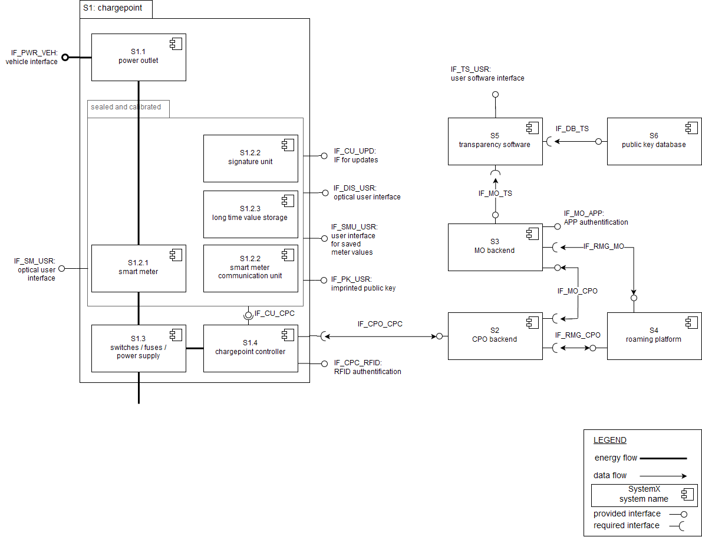

## Motivation

The goal of this open source project is to handle the German calibration regulation requirements for charging stations and associated parties. The problematic is the compliant billing of charging electric vehicles with public charging stations. 

For compatibility and standardized interfaces of different parties, its open source. The goal is to develop a harmonized solution that can be implemented by all parties in the market, providing one simple solution for all customers.

To reach this goal the project needs various members of different companies with different technical aspects. We have to collect all the different requirements, generalize a structur and the interfaces for compatibility. So the providers can create a solution as one, and not everyone for his own.

#### Background

The German calibration law regulates the calibration and processing of measurement instruments and the non falsifiability of its measured values. Therefore its required that consumers/users can check the originality of measured values, to be sure the billing is correct. 

## Table of Contents

 * [Scope](#Scope)
 * [Goals](#Goals)
 * [Supporters](#Supporters)
 * [Links](#Links)
 * [Contribution](#Contribution)
 * [License](#License)

## Goals

The solution under development aims to fulfill the following goals:

 * User friendly
 * Open source and free to use concept for all companies in the market.
 * Compatible with existing protocols.
 * Roaming-ready. One solution for all customers on all charge points.

## Scope

The following figure shows the scope of the project. Based on these components the solution proposals are developed. The scope is subject to change for further definition and clarification.

### Systems

The systems in the overview figure represent relevant function blocks which have to be taken into account.

### Interfaces

The conceptual interfaces to implement the requirements.

 * `IF_CPO_CPC`: **CPO Backend — chargepoint controller** sending of signed meter values
 * `IF_MO_CPO`: **MO backend — CPO backend** forwarding the signed values for billing
 * `IF_RMG_CPO`: **roaming platform — CPO backend** forwarding of CDRs with signed values to the associated roaming partner
 * `IF_RMG_MO`: **roaming platform — MO backend** forwarding of CDRs with signed values to the associated roaming partner
 * `IF_MO_TS`: **MO backend — transparency software** export signed values for transparency check
 * `IF_DB_TS`: **public key database — transparency software** get the charge points public key
 * `IF_MO_APP`: **MO backend — MO App** the user can authorize via the MO's apps
 * `IF_TS_USR`: **transparency software — user** user interface to check the billing hash
 * `IF_PK_USR`: **public key — user** the user can get the chargepoints public key directly
 * `IF_SMU_USR`: **smart meter additional units — user** the user can read get the saved meter values
 * `IF_CPC_RFID`: **chargepoint controller — RFID card** the user can authorize via his RFID card
 * `IF_SM_USR`: **smart meter — user** the user can see the meter values all the time while charging
 * `IF_PWR_VEH`: **power outlet — vehicle** interface to provide charging
 * `IF_CU_UPD`: **communication unit — update server** interface to enable software updates for the calibrated system parts
 * `IF_CU_CPC`: **communication unit — chargepoint controller** communication between the calibrated system parts and the chargepoint
 * `IF_DIS_USR`: **metering display — user** optical user interface for meter values

### Transparency Software

This software confirms the meter values signature with the chargepoints public key. It should be available as a mobile app or as a webapp. So everyone can check the meter values signatures.

### Public Key

The public key is available for the user offline, imprinted at the charging station, or online in a public database. The public key is necessary to confirm the gateways signature. 

## Supporters

 * [Wiedergrün](https://wiedergruen.com)
 * [GraphDefined](https://graphdefined.com/)

## Links

 * [MessEG](https://www.gesetze-im-internet.de/messeg/BJNR272300013.html)
 * [MessEV](https://www.gesetze-im-internet.de/messev/BJNR201100014.html)
 * [MsbG](https://www.gesetze-im-internet.de/messbg/BJNR203410016.html)
 * [PTB REA Dokument 6A](https://public.ptb.de/resources/show/10.7795/510.20170316B)
 * [BNetzA Ladesäulenkarte](https://www.bundesnetzagentur.de/DE/Sachgebiete/ElektrizitaetundGas/Unternehmen_Institutionen/HandelundVertrieb/Ladesaeulenkarte/Ladesaeulenkarte_node.html)

## Contribution

Any productive contributions are welcome!

 * Post thoughts about new features as issues
 * Post questions as issues or get in touch directly
 * To correct bugs send us pull request

If you are interested to work more intensive in this project, send us your request via our company homepages contact form at [wiedergruen.com](https://wiedergruen.com/).

## License

MIT see file [LICENSE](LICENSE).

