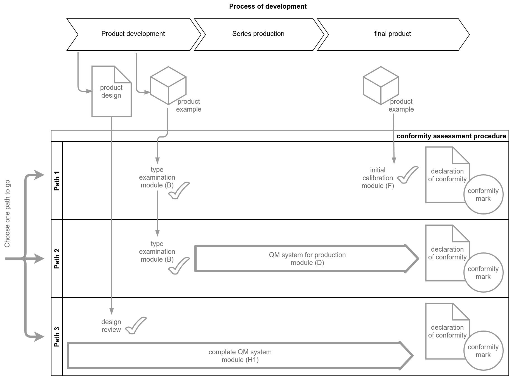

# Modular Conformity Assessment Procedure

It is required to fulfill the conformity assessment in order to get a _declaration of conformity_ for the charging system.

## Procedure overview

## Links

 * [Konformitätsbewertung (Wikipedia)](https://de.wikipedia.org/wiki/Konformit%C3%A4tsbewertung)
